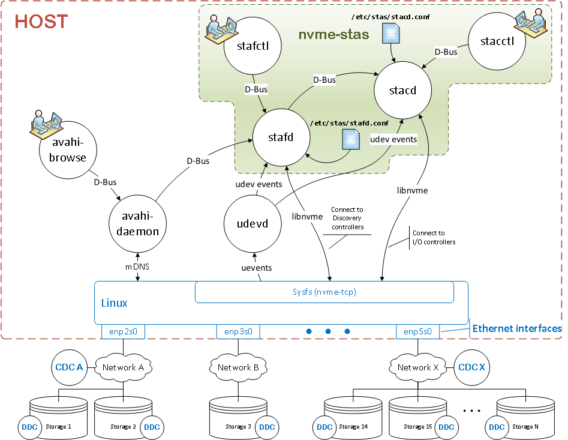

# nvme-stas - NVMe STorage Appliance Services (STAS)


[](https://github.com/astral-sh/ruff)
[](https://github.com/linux-nvme/nvme-stas/releases)
[](https://GitHub.com/linux-nvme/nvme-stas/commit/)
[](https://nvme-stas.readthedocs.io/en/latest/)
[](https://codecov.io/gh/linux-nvme/nvme-stas)
[](https://www.python.org/downloads/)

## What *nvme-stas* Provides

*nvme-stas* implements services that support NVMe-over-Fabrics (NVMe-oF) access by a Linux host. Specifically, it provides:

- A **Central Discovery Controller (CDC) client** for Linux
- **Asynchronous Event Notifications (AEN)** handling
- **Automated connection management** for NVMe subsystems
- **Error handling and reporting**
- Support for both **automatic (zeroconf)** and **manual configuration**

## High-Level Overview

*nvme-stas* is composed of two cooperating services:

***stafd*** - **STorage Appliance Finder Daemon**. 

*stafd* is responsible for discovering storage appliances and discovery controllers:

- Registers with the Avahi daemon for `_nvme-disc._tcp` mDNS service announcements, enabling **zero-touch provisioning (ZTP)**.
- Supports **manual discovery configurations** as an alternative to mDNS.
- Connects to discovered or configured Central or Direct Discovery Controllers (CDC/DDC).
- Retrieves discovery log pages from controllers.
- Caches discovered storage subsystem information.
- Exposes a **D-Bus API** for querying discovery status and metadata.

***stacd*** - **STorage Appliance Connector Daemon**. 

*stacd* handles connections to NVMe storage subsystems:

- Reads subsystem lists from *stafd* via **D-Bus**.
- Also supports manually configured subsystem lists.
- Establishes NVMe-oF I/O controller connections.
- Provides a D-Bus API for client tools to inspect I/O controller state.



## Design Notes

Both *stafd* and *stacd* are implemented in Python and are driven using the **[GLib main loop](https://lazka.github.io/pgi-docs/#GLib-2.0/classes/MainLoop.html#GLib.MainLoop)** for event-driven behavior.

GLib, along with libraries like `dasbus` and `pyudev`, provides core building blocks such as timers, DNS name resolution, and signal handling integration.

*stafd* leverages the `avahi-daemon` to detect Central Discovery Controllers (CDC) and Direct Discovery Controllers (DDC). It then uses **libnvme** to interface with the kernel NVMe stack and establish persistent connections to controllers.

## Service Management

Each service is managed via **systemd**. Common operations:

```bash
systemctl start stafd     # Start stafd
systemctl stop stafd      # Stop stafd
systemctl restart stafd   # Restart
systemctl reload stafd    # Reload config without restarting
```

Equivalent service units exist for *stacd*. Signals like `SIGTERM` and `SIGHUP` are used for orderly shutdowns and configuration reloads respectively.

## Configuration

Configuration is stored under `/etc/stas/`:

| File                   | Applies To    | Purpose                                                      |
| ---------------------- | ------------- | ------------------------------------------------------------ |
| `/etc/stas/sys.conf`   | stafd + stacd | Host-wide NVMe parameters (Host NQN, Host ID, optional Host symbolic name) |
| `/etc/stas/stafd.conf` | stafd         | Discovery controller configuration                           |
| `/etc/stas/stacd.conf` | stacd         | I/O controller configuration                                 |

Both services can operate with **automatically discovered controllers** (via Avahi) or **manually specified entries** in their respective config files.

## System Requirements

Linux kernel **5.14 or later** (kernel **5.18+** recommended for full feature support).

Required user-space dependencies include:

- **libnvme 3.0+** (Python bindings: `python3-libnvme`)
- Python 3 system bindings: `dasbus`, `pyudev`, `python3-systemd`, `python3-gi` (package names vary by distro). 

## Host Identification

*nvme-stas* requires a Host **NQN** and **Host ID** to operate. By default, it reads the following files:

1. `/etc/nvme/hostnqn`
2. `/etc/nvme/hostid`

This ensures consistency with other NVMe tools like `nvme-cli` and `libnvme`. Alternative values can be set in `/etc/stas/sys.conf`.

## D-Bus Security and Trust

Both *stafd* and *stacd* communicate over the **system D-Bus bus**. D-Bus policy
files (installed under `/usr/share/dbus-1/system.d/`) control which callers are
allowed to own or interact with the service names. Only processes running as
**root** (or with explicit D-Bus policy permission) can invoke the service
interfaces.

*stacd* subscribes to D-Bus signals emitted by *stafd* (`log_pages_changed` and
`dc_removed`). These signals arrive over the trusted system bus — *stacd* does
not accept instructions from untrusted sources.

The host credentials written to `/run/nvme-stas/` by the daemons (e.g. the
last-known-config pickle file) are protected by root-only filesystem
permissions. Do not grant untrusted users write access to that directory.

## Build, Install & Tests

This Python project uses **Meson** as its build system:

```
meson setup .build
meson compile -C .build
meson install -C .build
meson test -C .build
```

For users unfamiliar with Meson, an alternate `configure && make` build is provided that performs equivalent steps. 

## **Companion CLI Utilities**

*nvme-stas* ships basic utilities:

- `stafctl` – interact with *stafd*.
- `stacctl` – interact with *stacd*.
- `stasadm` – administer system NVMe config (e.g., generating host NQN/ID). 

## Addendum 

For additional troubleshooting and building info, refer to: 
[**ADDENDUM.md**](./ADDENDUM.md)


