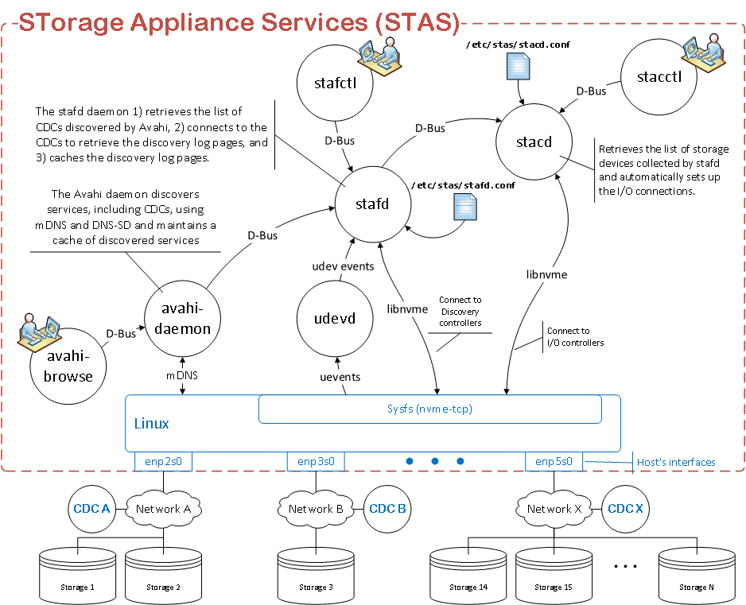

# STorage Appliance Services (STAS)

What does nvme-stas provide?

- A Central Discovery Controller (CDC) client for Linux
- Asynchronous Event Notifications (AEN) handling
- Automated NVMe subsystem connection controls
- Error handling and reporting
- Automatic (zeroconf) and Manual configuration

## Overview

STAS is composed of two services, STAF and STAC, running on the Host computer.

**STAF** - **STorage Appliance Finder**. The tasks performed by STAF include:

- Register with the Avahi daemon for service type `_nvme-disc._tcp`. This allows STAF to locate Central or Direct Discovery Controllers (CDC, DDC) with zero-touch provisioning (ZTP). STAF also allows users to manually enter CDCs and DDCs in a configuration file (`/etc/stas/stafd.conf`) when users prefer not to use ZTP.
- Connect to discovered or configured CDCs or DDCs.
- Retrieve the list of storage subsystems using the "get log page" command.
- Maintain a cache of the discovered storage subsystems.
- Provide a D-Bus interface where 3rd party applications can retrieve the data about the Discovery Controller connections (e.g. log pages).

**STAC** - **STorage Appliance Connector**. The tasks performed by STAC include:

- Read the list of storage subsystems from STAF over D-Bus.
- Similar to STAF, STAC can also read a list of storage subsystems to connect to from a configuration file.
- Set up the I/O controller connections.
- Provide a D-Bus interface where 3rd party applications can retrieve data about the I/O controller connections.



## Design

**`stafd`** and **`stacd`** use the GLib main loop. The GLib Python module provides several low-level building blocks that are needed by **`stafd`** and **`stacd`**. In addition, many Python modules "play nice" with GLib such as `dasbus` and `pyudev`. GLib also provides additional components such as timers, signal handlers, and much more.

**`stafd`** connects to the `avahi-daemon`, which it uses to detect Central Discovery Controllers (CDC) and Direct Discovery Controllers (DDC). When Discovery Controllers (DC) are found with Avahi's help, **`stafd`** uses `libnvme` to set up persistent connections and retrieve the discovery log pages.

## Daemonization

**`stafd`** and **`stacd`** are managed as `systemd` services. The following operations are supported (here showing only `stafd`, but the same operations apply to `stacd`):

- `systemctl start stafd`. Start daemon.
- `systemctl stop stafd`. Stop daemon. The `SIGTERM` signal is used to tell the daemon to stop.
- `systemctl restart stafd`. Effectively a `stop` + `start`.
- `systemctl reload stafd`. Reload configuration. This is done in real time without restarting the daemon. The `SIGHUP` signal is used to tell the daemon to reload its configuration file.

## Configuration

As stated before, **`stafd`** can automatically locate discovery controllers with the help of Avahi and connect to them, and **`stacd`** can automatically set up the I/O connections to discovered storage subsystems. However, **`stafd`** and **`stacd`** can also operate in a non-automatic mode based on manually entered configuration. In other words, discovery controllers and/or storage subsystems can be entered manually. This is to provide customers with more flexibility. The configuration for each daemon is found in **`/etc/stas/stafd.conf`** and **`/etc/stas/stacd.conf`** respectively. The configuration files also provide additional parameters, such as log-level attributes used mainly for debugging purposes.

The following configuration files are defined:

| File                   | Consumer          | Purpose                                                      |
| ---------------------- | ----------------- | ------------------------------------------------------------ |
| `/etc/stas/sys.conf`   | `stafd` + `stacd` | Contains system-wide (i.e. host) configuration such as the Host NQN, the Host ID, and the Host Symbolic Name. Changes to this file can be made manually or with the help of the `stasadm` utility as described in the previous section. <br /><br />For example, `stasadm hostnqn -f /etc/nvme/hostnqn` writes the Host NQN to the file `/etc/nvme/hostnqn`, but also adds an entry to `/etc/stas/sys.conf` to indicate where the Host NQN has been saved. <br /><br />This gives nvme-stas the flexibility of defining its own Host parameters or to use the same parameters defined by `libnvme` and `nvme-cli`. |
| `/etc/stas/stafd.conf` | `stafd`           | Contains configuration specific to `stafd`. Discovery controllers can be manually added or blacklisted in this file. |
| `/etc/stas/stacd.conf` | `stacd`           | Contains configuration specific to `stacd`. I/O controllers can be manually added or blacklisted in this file. |

## D-Bus interface

The interface to **`stafd`** and **`stacd`** is D-Bus. This allows other programs, such as **`stafctl`** and **`stacctl`**, to communicate with the daemons. This also provides third parties the ability to write their own applications that can interact with **`stafd`** and **`stacd`**. For example, someone could decide to write a GUI where they would display the discovery controllers as well as the all the discovery log pages in a "pretty" window. The next table provides info about the two D-Bus interfaces.

| Component | D-Bus address                  |
| --------- | ------------------------------ |
| `stafd`   | **`org.nvmexpress.staf.conf`** |
| `stacd`   | **`org.nvmexpress.stac.conf`** |

## Companion programs: `stafctl` and `stacctl`

**`stafctl`** and **`stacctl`** are utilities that allow users to interact with **`stafd`** and **`stacd`** respectively. This is a model used by several programs, such as `systemctl` with `systemd`.

At a minimum, these utilities provide debug tools, but they could also provide some configuration capabilities (TBD).

## Packages

**`stafd`** and **`stacd`** as well as their companion programs **`stafctl`** and **`stacctl`** are released together in a package called "**`nvme-stas`**" for **ST**orage **A**pplicance **S**ervices (e.g. `stas-1.0.0-1.x86_64.rpm` or `stas_1.0.0_amd64.deb`).

## Dependencies

 **`stafd`**/**`stacd`** require Linux kernel 5.14 or later. 

The following packages must be installed to use **`stafd`**/**`stacd`**

**Debian packages (tested on Ubuntu 20.04):**

```bash
sudo apt-get install -y python3-pyudev python3-systemd python3-gi python3-netifaces
sudo pip3 install dasbus
```

**Yum packages (tested on Fedora 34):**

```bash
sudo dnf install -y python3-dasbus python3-pyudev python3-systemd python3-gobject python3-netifaces
```

# STAF - STorage Appliance Finder


| Component | Description                                              |
| --------------- | -------------------------------------------------------- |
| **`/usr/sbin/stafd`** | A daemon that finds (discovers) NVMe storage appliances. |
| **`/usr/bin/stafctl`** | A companion shell utility for `stafd`.                  |
| **`/etc/stas/stafd.conf`** | Configuration file |

## stafd configuration file

The configuration file is named `/etc/stas/stafd.conf`. This file contains configuration parameters for the **`stafd`** daemon. One of the things you may want to configure is the IP address of the discovery controller(s) you want **`stafd`** to connect to. The configuration file contains a description of all the parameters that can be configured.

## Service discovery with Avahi

**`stafd`** can automatically find and set up connections to Discovery Controllers. To do this, **`stafd`** registers with the [Avahi](https://www.avahi.org/), the mDNS/DNS-SD (Service Discovery) daemon. Discovery Controllers that advertise themselves with service type `_nvme-disc._tcp` will be recognized by Avahi, which will inform **`stafd`**.

# STAC - STorage Appliance Connector


| File name                  | Description                                        |
| -------------------------- | -------------------------------------------------- |
| **`/usr/sbin/stacd`**      | A daemon that connects to NVMe storage appliances. |
| **`/usr/bin/stacctl`**     | A companion shell utility for `stacd`.             |
| **`/etc/stas/stacd.conf`** | Configuration file                                 |

## stacd configuration file

The configuration file is named `/etc/stas/stacd.conf`. In this file you can configure storage appliances that **`stacd`** will connect to. By default, **`stacd`** uses information (log pages) collected from **`stafd`** to connect to storage appliances. However, you can also manually enter IP addresses of storage appliances in this file.

# System configuration

A host must be provided with a Host NQN and a Host ID. `nvme-stas` will not run without these two mandatory configuration parameters. To follow in the footsteps of `nvme-cli` and `libnvme`, `nvme-stas` will use the same Host NQN and ID that `nvme-cli` and `libnvme` use by default. In other words, `nvme-stas` will read the Host NQN and ID from these two files by default:

1. `/etc/nvme/hostnqn`
2. `/etc/nvme/hostid`

Using the same configuration files will ensure consistency between `nvme-stas`, `nvme-cli`, and `libnvme`. On the other hand, `nvme-stas` can operate with a different Host NQN and/or ID. In that case, one can specify them in `/etc/stas/sys.conf`. 

A new optional configuration parameters introduced in TP8010, the Host Symbolic Name, can also be specified in `/etc/stas/sys.conf`. The schema/documentation for `/etc/stas/sys.conf` can be found `/etc/stas/sys.conf.doc`.

# Build, install, unit tests

STAS uses the `meson` build system. Since STAS is a Python project, there is no code to build. However, the code needs to be installed using `meson`. Once installed, unit tests can be run with `meson` as well.

## Using meson

Invoke `meson` to configure the project:

```bash
meson .build
```

Note that the first line, `meson .build`, need only be called once. This analyzes the project and the host computer to determine if all the necessary tools are available. The result is in the directory named `.build`.

Do as follows to compile the code:

```bash
cd .build
ninja
```

Do as follows to install the code:

```bash
cd .build
meson install
```

Do as follows to run the unit tests:

```bash
cd .build
meson test
```

## Alternate approach using Good-ole make

Recognizing that many people are not familiar with `meson`, we're providing a second way to install the code using the more familiar `configure` script combined with a `make`.

```bash
./configure
make
```

This performs the same operations as the meson approach described above. The `configure` script simply invokes `meson .build` and generates a `Makefile`. The generated `Makefile` provides the following operations.

| make command       | Corresponding commands using meson                           |
| ------------------ | ------------------------------------------------------------ |
| **`make`**         | Doesn't really do anything since there is nothing to build. However, this can be used to update the meson configuration after modifying `meson.build` files. |
| **`make install`** | cd .build; meson install                                     |
| **`make test`**    | cd .build; meson test                                        |
| **`make clean`**   | Clean build artifacts, but does not remove the meson's configuration. That is, the `.build` directory is preserved. |
| **`make purge`**   | Remove all build artifacts including the `.build` directory. If you want to build the code after running this command, you will need to first run `./configure`. |

## Compiling and running nvme-stas in a docker container

Use published image (optional)
```bash
docker pull ghcr.io/linux-nvme/nvme-stas:main
```

Build your own image (optional)
```bash
docker-compose up --build
```

Run services using docker-compose like this
```bash
docker-compose up
```

Run companion programs **`stafctl`** and **`stacctl`** like this
```bash
docker-compose exec stafd stafctl ls
docker-compose exec stafd stafctl status

docker-compose exec stacd stacctl ls
docker-compose exec stacd stacctl status
```

dependencies: dbus, avahi.

## Generating man and html pages

nvme-stas uses the following programs to generate the documentation. These can be installed as shown in the "dependencies" section.

- `xsltproc` - Used to convert DocBook XML notation to "man pages" and "html pages".
- `gdbus-codegen` - Used to convert D-Bus IDL to DocBook XML notation.

### Dependencies

The following packages must be installed to generate the documentation

**Debian packages (tested on Ubuntu 20.04):**

```bash
sudo apt-get install -y docbook-xml docbook-xsl xsltproc libglib2.0-dev
```

**Yum packages (tested on Fedora 34):**

```bash
sudo dnf install -y docbook-style-xsl libxslt glib2-devel
```

### Configuring to build the man and html pages

By default, the documentation is not built. You need to run the `configure`  as follows to tell meson that you want to build the documentation. You may need to first purge any previous configuration.

```bash
make purge
./configure -Dman=true -Dhtml=true
make
```


 

