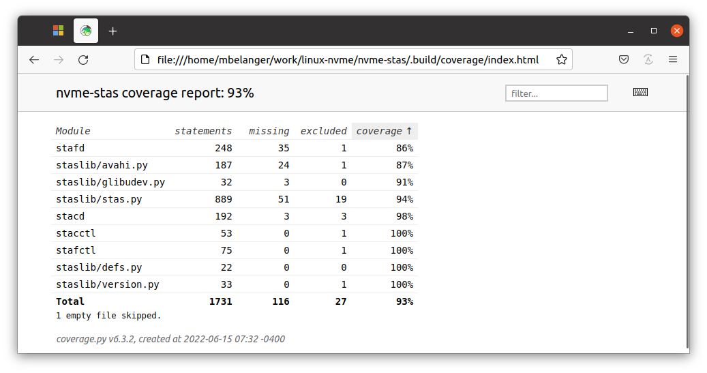

# Overview

For quick and easy testing, it's possible to run a storage subsystem simulator using the `nvmet` driver. This is how most of the testing was done during `nvme-stas` development. The main feature that cannot be tested this way is mDNS discovery.

There are two ways to run the tests. 

- The first one involves starting all the components manually and using the nvmet driver as the storage appliance.
- The second one is fully automated and can be invoked simply by running `make coverage`.

[toc]

# Manual testing using the nvmet driver

A script is provided (`utils/nvmet/nvmet.py`) to simplify the configuration of the `nvmet` driver. The script comes with a companion configuration file (`utils/nvmet/nvmet.conf`). The configuration file is where you configure the port(s) and subsystem(s) to create. The default configuration will create 3 subsystems under port 1. This is mapped to the local IPv6 loopback address (`::1`).

Since nvmet doesn't provide a mDNS responder, you will need to manually configure `stafd` (`/etc/stas/stafd.conf`) so that it connects to the DDC that the nvmet driver creates by adding the DDC's address under the `[Controllers]` section. For example:

```bash
[Controllers]
controller=transport=tcp;traddr=localhost
```

## Monitoring

While testing it's a good idea to follow the journal in real time to see how `stafd` and `stacd` are performing. In a terminal (e.g. `bash`) do:

```bash
$ sudo journalctl --system --full -o short-precise --follow
```

You probably don't really need all these options, but they will give you full view of the messages with a millisecond time resolution. I personally define an alias `alias j='sudo journalctl --system --full -o short-precise'` and then I need only invoke `j -f`. Or even better, I add my user to the `systemd-journal` group so that I don't have to use `sudo` to see system-level log messages (Ref: [systemd-journal.service](https://www.freedesktop.org/software/systemd/man/systemd-journald.service.html#Access%20Control)).

## Test startup 

Here's a step-by-step guide to start `stafd` and `stacd` and connect to the `nvmet` driver. Open a second terminal and enter the following commands (these commands assume that nvme-stas will be cloned under `~/work/nvme-stas` referred to as `$STAS_DIR`):

### Clone nvme-stas (if not done already)

```bash
$ mkdir ~/work
$ cd ~/work
$ git clone https://github.com/linux-nvme/nvme-stas.git
$ STAS_DIR=~/work/nvme-stas
```

### Build and install nvme-stas

```bash
$ cd $STAS_DIR
$ make install
```

### Create a post-install script

Create an executable shell script (call it `stas-config.sh`) with the following contents. These are post-installation configuration steps required every time `nvme-stas` is reinstalled. Place the script in a directory that is in the search `$PATH` so that it can be invoked easily.

```bash
#!/usr/bin/env bash
#####################################################################
# Must run daemon-reload after installing nvme-stas
sudo systemctl daemon-reload

#####################################################################
# Make sure Host NQN and ID are configured 
if [ ! -d "/etc/nvme" ]; then
    sudo mkdir /etc/nvme
fi

if [ ! -s /etc/nvme/hostnqn ]; then
    sudo stasadm hostnqn -f /etc/nvme/hostnqn
fi

if [ ! -s /etc/nvme/hostid ]; then
    sudo stasadm hostid -f /etc/nvme/hostid
fi

#####################################################################
# Edit /etc/stas/stafd.conf to enable tracing and add the local 
# nvmet driver as the Discovery Controller to connect to.
FILES="stafd.conf stacd.conf"
for file in ${FILES}; do
	sudo sed -i '/^#tron=false/a tron=true' /etc/stas/${file}
done 
sudo sed -i '/^#controller=$/a controller=transport=tcp;traddr=localhost' /etc/stas/stafd.conf

```

### Run the post-install script

```bash
$ stas-config.sh	
```

### Start the nvmet driver

```bash
$ cd $STAS_DIR/utils/nvmet
$ sudo ./nvmet.py create
```

### Start stafd and stacd

```bash
$ sudo systemctl start stafd stacd
```

## So, is it running yet?

You should have seen `stafd` and `stacd` starting in the first terminal where `journalctl` is following the system log. At this point `stafd` should have connected to the `nvmet` discovery controller and retrieved the discovery log page entries (DLPE). And `stacd` should have retrieved the DLPEs from `stafd` and connected to the 3 subsystems defined in `nvmet.conf`. This can be confirmed as follows:

```bash
$ stafctl ls
[{'device': 'nvme0',
  'host-iface': '',
  'host-traddr': '',
  'subsysnqn': 'nqn.2014-08.org.nvmexpress.discovery',
  'traddr': '::1',
  'transport': 'tcp',
  'trsvcid': '8009'}]
```

And:

```bash
$ stacctl ls
[{'device': 'nvme1',
  'host-iface': '',
  'host-traddr': '',
  'subsysnqn': 'klingons',
  'traddr': '::1',
  'transport': 'tcp',
  'trsvcid': '8009'},
 {'device': 'nvme2',
  'host-iface': '',
  'host-traddr': '',
  'subsysnqn': 'nqn.1988-11.com.dell:PowerSANxxx:01:20210225100113-454f73093ceb4847a7bdfc6e34ae8e28',
  'traddr': '::1',
  'transport': 'tcp',
  'trsvcid': '8009'},
 {'device': 'nvme3',
  'host-iface': '',
  'host-traddr': '',
  'subsysnqn': 'starfleet',
  'traddr': '::1',
  'transport': 'tcp',
  'trsvcid': '8009'}]
```

You can also use `nvme-cli` to list the connections. For example: `nvme list -v`.

## Generating Asynchronous Event Notifications (AEN)

You can use the `nvmet.py` script to simulate the removal of a subsystem, which results in an AEN being sent to indicate a "Change of Discovery Log Page". Here's how:

```bash
$ cd $STAS_DIR/utils/nvmet
$ sudo ./nvmet.py unlink -p 1 -s klingons
```

Observe what happens in the journal. `stafd` will receive the AEN and update the DLPEs by performing a Get Discovery Log Page command. And `stacd` will disconnect from the "`klingons`" subsystem (use `stacctl ls` to confirm).

Then, add the subsystem back as follows:

```bash
$ sudo ./nvmet.py link -p 1 -s klingons
```

**NOTE**: I know, "`klingons`" is not a valid NQN, but it sure is easier to remember and to type than a valid NQN. Fortunately, the `nvmet` driver doesn't care what the actual subsystem's NQN looks like. :smile:

## Stopping nvmet

```bash
$ cd $STAS_DIR/utils/nvmet
$ sudo ./nvmet.py clean
```

# Automated testing using the coverage test

This requires the [Python coverage package](https://coverage.readthedocs.io/en/6.4.1/), which can be installed as follows:

```bash
$ sudo apt-get install python3-coverage
```

Note that this test cannot be run while `stafd` and `stacd` are running. Make sure to stop `stafd` and `stacd` if they are running (`systemctl stop [stafd|stacd]`). You may also need to mask those services (`systemctl mask [stafd|stacd]`) if coverage fails to start. 

To run the coverage test, from the root of the `nvme-stas` git repo:

```bash
$ make coverage
```

This will start `stafd`, `stacd`, and the `nvmet` target. At the end, if all goes well, you should get an output similar to this:

```bash
Name                 Stmts   Miss  Cover
----------------------------------------
stacctl                 53      0   100%
stacd                  190      3    98%
stafctl                 75      0   100%
stafd                  246     21    91%
staslib/avahi.py       185     19    90%
staslib/defs.py         22      0   100%
staslib/stas.py        858     51    94%
staslib/version.py      31      0   100%
----------------------------------------
TOTAL                 1660     94    94%
```

Note that the Python coverage package has trouble tracking code executed in threads. And since nvme-stas uses threads, some of the code will not be accounted for (in other words, you'll never get 100% coverage).

Also note, that some of the code (e.g. explicit registration per TP8010) only gets executed when connected to a CDC (not a DDC). So, depending on your environment you will most likely get different coverage result. The above test was done on a system where mDNS discovery with a CDC was available, which provides more coverage than using the `nvmet` driver alone.

An HTML output is also available where you can click on each file and which lines of code got executed and which ones were missed. In your web browser, simply type `file:///[$STAS_DIR]/.build/coverage/index.html`  (you must replace `[$STAS_DIR]` by the actual location of the nvme-stas repo where `make coverage` was run) . You should get something like this:

